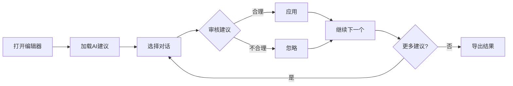

# 🤖 AI建议使用说明

## 📁 相关文件

```
entity_editor_ai.html              # 新的编辑器界面（支持AI建议）
ai_merge_suggestions.json          # AI生成的207组合并建议
conversation_entity_edits_curated.json  # 原有的编辑记录
```

## 🚀 使用步骤

### 1. 打开编辑器

在浏览器中打开：
```
entity_editor_ai.html
```

**AI建议已自动加载**（207组），无需手动导入！

### 2. 查看和审核建议

**界面布局:**
```
┌─────────────┬──────────────┬─────────────────┐
│  对话列表    │  实体列表     │  AI建议         │
│             │              │                 │
│ ✓ 对话1     │  实体1       │  建议1: 应用    │
│   对话2     │  实体2       │  建议2: 应用    │
│   对话3 🟢  │  实体3       │  建议3: 忽略    │
│             │              │                 │
└─────────────┴──────────────┴─────────────────┘
        ↑                             ↑
   有AI建议的对话                   每个建议可单独应用
   会显示绿色徽章
```

**对话列表:**
- 有AI建议的对话会显示绿色徽章（如"5条AI建议"）
- 已编辑过的对话背景为浅橙色

**AI建议面板（右侧）:**
每个建议显示：
- **最终名称**: 合并后的实体名
- **实体列表**: 将被合并的所有实体
- **原因**: AI给出的合并理由
- **操作按钮**:
  - **应用此建议**: 将此合并规则添加到编辑中
  - **忽略**: 标记为不采纳

### 4. 应用建议

对于每个AI建议，你可以：

#### ✅ 应用
点击**「应用此建议」**按钮
- 自动添加到 `manual_merges` 列表
- 按钮变为灰色「✓ 已应用」
- 实体列表会更新显示

#### ❌ 忽略
点击**「忽略」**按钮
- 建议变灰但不删除
- 不会应用到编辑中

### 5. 导出结果

完成后点击底部的**「💾 导出编辑结果」**按钮
- 下载更新后的 `conversation_entity_edits_curated.json`
- 包含原有编辑 + 新应用的AI建议

## 📊 AI建议统计

```
总共: 207 组合并建议
覆盖: 138 个对话
成功率: 100% (0个错误)
```

## 🎯 建议类型示例

### 1. 同一人的不同称呼
```
最终名称: 蔡徐坤
实体: 坤坤, 蔡徐坤
原因: 同一个人的不同称呼
```

### 2. 家庭关系合并
```
最终名称: 高一峰的妻子
实体: 高一峰妻子, 高一峰的太太, 高一峰的妻子
原因: 指同一家庭成员的不同表述
```

### 3. 音译/拼写变体
```
最终名称: 盖伦
实体: 盖伦, 戈伦, 谷轮
原因: 同一名字的不同音译形式
```

## ⚠️ 注意事项

### 审核建议时请注意：

1. **验证身份**: 确认实体确实指同一个人
2. **检查上下文**: 有些相似名字可能是不同的人
3. **最终名称**: 确保选择的最终名称是最明确的版本
4. **家庭关系**: 注意区分不同人的相同关系（如"妈妈"可能指不同的母亲）

### 不要应用的情况：

- ❌ 名字相似但明显是不同的人
- ❌ 通用称呼（如"朋友"、"同事"）
- ❌ AI理由不充分或不清楚的建议

## 🔄 工作流程



## 💡 提示

- 可以随时导出，不必一次性完成所有对话
- 已应用的建议会自动保存在界面中
- 可以先处理有AI建议的对话（有绿色徽章的）
- 建议优先处理实体数量多的对话（如"妈"、"成都乖巧萌"等）

## 📝 导出格式

应用AI建议后，导出的JSON格式：

```json
{
  "conversation_edits": {
    "对话名": {
      "excluded_entities": [...],
      "manual_merges": [
        {
          "final_name": "最终名称",
          "merged_entity_names": ["实体1", "实体2"],
          "source": "ai_suggestion",
          "applied_at": "2026-03-06T04:30:00.000Z"
        }
      ]
    }
  }
}
```

注意：
- `source: "ai_suggestion"` 标记这是从AI建议应用的
- `applied_at` 记录应用时间
- 手动编辑的合并没有这两个字段

## 🎉 完成后

将更新后的 `conversation_entity_edits_curated.json` 应用到知识图谱构建流程中。
